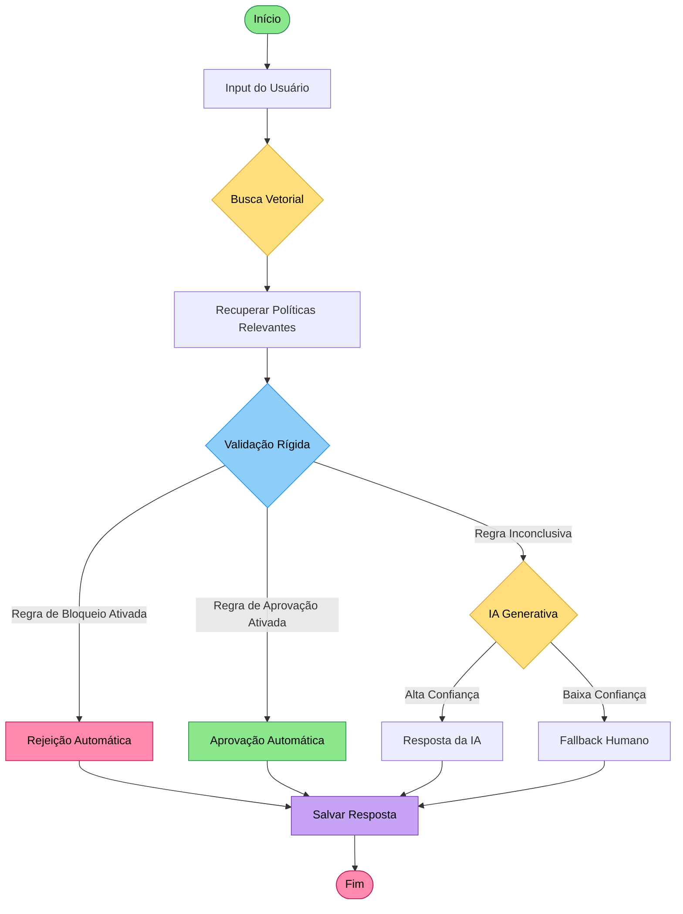

# (POC GenAI iFood) Agente de Reembolso Inteligente - Arquitetura Híbrida
Sistema de IA para automação de decisões de reembolso que combina **busca semântica (RAG)** para interpretação de políticas e **validação determinística com Python** para compliance financeiro.

## Funcionalidades

- **Interpretação de políticas via RAG** - Busca vetorial para entender nuances de texto
- **Validação determinística** - Regras de "Hard Block" para compliance financeiro
- **Decisões automáticas** - Aprovação ou rejeição baseada em regras e IA
- **Fallback humano** - Escalação quando confiança é baixa
- **Base de conhecimento** - CSV com políticas do iFood GenAI
- **Persistência de respostas** - Histórico salvo em JSON
- **Interface interativa** - CLI com menu de opções
- **Geração de relatórios** - Estatísticas de reclamações processadas

---

## Fluxo de Decisão



---

## Arquitetura

**Camada de Conhecimento (RAG)**
- Busca semântica via embeddings vetoriais
- Base de conhecimento estruturada em CSV
- Recuperação de políticas relevantes por contexto

**Camada Determinística (Python)**
- Regras de negócio críticas em Python
- Validação de compliance financeiro
- "Hard Blocks" para casos específicos

**Camada de Orquestração**
- Gerenciamento do fluxo de decisão
- Fallback automático para humanos
- Persistência de histórico em JSON

---

## Tecnologia

**RAG (Retrieval-Augmented Generation)** - Combinação de busca e geração:
- Embeddings vetoriais para busca semântica
- Recuperação de políticas relevantes
- Geração de respostas contextualizadas

**Validação Determinística** - Regras de negócio em Python:
- Validação de valores e prazos
- Compliance financeiro automático
- Bloqueios por tipo de reclamação

**Persistência de Dados**:
- Base de conhecimento: CSV estruturado
- Histórico de respostas: JSON
- Modelos de dados: Pydantic

---

## Uso

### Passo 1: Executar o sistema

```powershell
python main.py
```

### Passo 2: Interagir com o menu

O sistema apresentará um menu interativo:

```
======================================================================
 Agente de Reembolso Inteligente - iFood GenAI
======================================================================

Menu de Opções:
  1. Registrar nova reclamação
  2. Visualizar histórico de reclamações
  3. Gerar relatório de estatísticas
  4. Buscar reclamação por ID
  5. Sair

Escolha uma opção (1-5):
```

### Passo 3: Registrar reclamação

Escolha a opção `1` e forneça os detalhes:

```
Digite a descrição da reclamação: Meu pedido chegou frio e quero reembolso

Processando reclamação...

[BUSCA VETORIAL] Recuperando políticas relevantes...
  Encontradas 3 políticas relacionadas

[VALIDAÇÃO RÍGIDA] Aplicando regras de negócio...
  Regra: Reembolso permitido dentro de 7 dias
  Status: APROVADO

[IA GENERATIVA] Gerando resposta personalizada...
  Confiança: 92%

Decisão: APROVADO
Resposta: Seu reembolso foi aprovado conforme política de 7 dias...

Reclamação salva com ID: REC-20251126-001
```

### Passo 4: Visualizar histórico

Escolha a opção `2` para ver todas as reclamações processadas:

```
======================================================================
 Histórico de Reclamações
======================================================================

ID: REC-20251126-001
Data: 2025-11-26 14:30:22
Descrição: Meu pedido chegou frio e quero reembolso
Decisão: APROVADO
Confiança: 92%
----------------------------------------------------------------------

ID: REC-20251126-002
Data: 2025-11-26 14:35:10
Descrição: Quero cancelar meu pedido de 3 semanas atrás
Decisão: REJEITADO
Confiança: 98%
----------------------------------------------------------------------

Total de reclamações: 2
```

### Passo 5: Gerar relatório

Escolha a opção `3` para estatísticas:

```
======================================================================
 Relatório de Estatísticas
======================================================================

Total de reclamações: 15
Aprovações automáticas: 8 (53%)
Rejeições automáticas: 5 (33%)
Fallback humano: 2 (13%)

Confiança média: 87%
Tempo médio de resposta: 1.2s

Categorias mais frequentes:
  1. Reembolso - 6 casos
  2. Cancelamento - 4 casos
  3. Qualidade - 3 casos
  4. Entrega - 2 casos
```

---

## Configurações Avançadas

### Ajustar threshold de confiança

No arquivo `reclamacoes.py`, modifique o limite para fallback humano:

```python
CONFIDENCE_THRESHOLD = 0.85  # Padrão: 85%
```

Se confiança < 85%, escalará para humano.

### Adicionar novas regras de validação

No arquivo `reclamacoes.py`, adicione regras determinísticas:

```python
def validar_regras(reclamacao: Reclamacao) -> str:
    # Exemplo: Bloquear reembolsos acima de R$ 500
    if reclamacao.valor_pedido > 500:
        return "REJEITADO"
    
    # Exemplo: Aprovar cancelamentos em até 1 hora
    if reclamacao.tempo_desde_pedido < 60:
        return "APROVADO"
    
    return "INCONCLUSIVO"
```

### Customizar base de conhecimento

Adicione novas políticas ao CSV:

```csv
categoria,pergunta,resposta,confianca
Promocao,Posso usar cupom expirado?,Não cupons têm validade,0.99
Entrega,Entregador não chegou?,Aguarde 15min ou cancele,0.90
```

### Exportar relatórios em CSV

Modifique `gerenciador_json.py` para exportar:

```python
import pandas as pd

def exportar_relatorio_csv(reclamacoes: list) -> None:
    df = pd.DataFrame([r.dict() for r in reclamacoes])
    df.to_csv('relatorio_reclamacoes.csv', index=False)
```

---

## Troubleshooting

### Erro: "Arquivo CSV não encontrado"
- **Solução:** Verifique se `base_conhecimento_ifood_genai-exemplo.csv` existe na pasta
- **Alternativa:** Crie um CSV com a estrutura: `categoria,pergunta,resposta,confianca`

### Baixa confiança em todas as respostas
- **Causa:** Base de conhecimento pequena ou não relacionada
- **Solução:** Adicione mais políticas relevantes ao CSV

### Erro: "JSON decode error"
- **Causa:** Arquivo `resposta_usuario.json` corrompido
- **Solução:** Delete o arquivo - será recriado automaticamente

### Reclamações não sendo salvas
- **Causa:** Permissões de escrita no diretório
- **Solução:** Execute como administrador ou mude permissões da pasta

### IA sempre retorna fallback humano
- **Causa:** Threshold de confiança muito alto
- **Solução:** Reduza `CONFIDENCE_THRESHOLD` para 0.70-0.75

### Validação rígida não funciona
- **Causa:** Regras não implementadas ou dados faltando
- **Solução:** Verifique se todos os campos da `Reclamacao` estão preenchidos

---

## Possíveis Melhorias

### Machine Learning e IA Avançada
- **Modelo de classificação:** Treinar com histórico de decisões
- **Análise de sentimento:** Detectar urgência e frustração do cliente
- **Predição de churn:** Identificar clientes em risco de abandono

### Análise e Relatórios
- **Analytics avançado:** Métricas de performance e KPIs
- **Exportação múltipla:** PDF, Excel, Power BI
- **Auditoria completa:** Logs detalhados de todas as decisões
- **A/B Testing:** Comparar eficácia de diferentes estratégias

### Segurança e Compliance
- **Criptografia:** Proteger dados sensíveis (LGPD/GDPR)
- **Auditoria de compliance:** Rastreabilidade de decisões
- **Rate limiting:** Prevenir abuso do sistema
---

## Licença

Este projeto é uma POC (Prova de Conceito) para fins educacionais e de demonstração. Use como base para implementações em produção respeitando compliance e regulamentações aplicáveis.